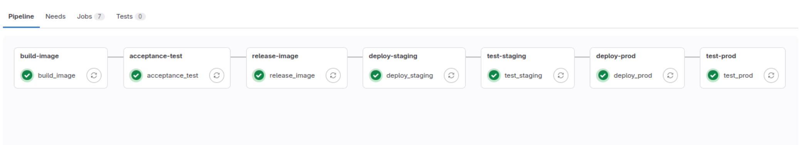

# Mini-projet GitLab CI

Dans ce projet, j'ai conteneurisé un site web statique disponible sur mon Github sous le lien https://github.com/sid-rabhi/static-website-example/ et j'ai mis en place un pipeline de CI/CD sur mon GitLab https://gitlab.com/sid-rabhi/staticwebsite pour automatiser les étapes de construction, de test et de déploiement de l'application sur Heroku. Ce rapport explique les étapes du pipeline que vous trouverez dans le fichier `.gitlab-ci.yml`, et les avantages de cette approche.

---

Auteur : Sid Ahmed Rabhi

Contexte : formation Bootcamp DevOps promotion 16

Centre de formation : Eazytraining

Période : novembre-décembre-janvier

Date : 06 janvier 2024

LinkedIn : https://www.linkedin.com/in/sid-ahmed-rabhi/

## Aperçu du pipeline CI/CD

## Workflow du Pipeline CI/CD avec Conditions d'Exécution

1. **Build image**
   - *Condition* : S'exécute pour chaque commit.
   - Build l'image Docker en utilisant le Dockerfile que j'ai créé.
   - Enregistre l'image dans un artefact sous le nom `staticwebsite.tar`
   
2. **Acceptance test**
   - *Condition* : S'exécute pour chaque commit.
   - Charge l'image à partir de l'artefact `staticwebsite.tar`, puis exécute le conteneur.
   - Teste l'application en effectuant un curl.

3. **Release image**
   - *Condition* : S'exécute pour chaque commit.
   - Publie l'image Docker dans le registre de GitLab.
   - Charge l'image à partir de l'artefact `staticwebsite.tar`, puis la tag avec le nom de la branche et le commit SHA.
   - Pousse l'image dans le registre de GitLab pour garder une trace des images pour chaque commit et branche.

4. **Deploy review**
   - *Condition* : S'exécute pour chaque nouvelle merge request ou mise à jour d'une merge request existante.
   
   
5. **Stop review**
   - *Condition* : S'exécute lorsqu'une merge request est fermée ou acceptée.
   

6. **Deploy staging**
   - *Condition* : S'exécute lorsqu'un commit est poussé sur la branche `main`.
   - Déploie l'application dans un environnement de préproduction (staging) sur Heroku.
   
7. **Test staging**
   - *Condition* : S'exécute après le déploiement réussi dans l'environnement de préproduction.
   - Exécute un curl sur l'environnement de préproduction pour s'assurer que l'application fonctionne correctement.
   
8. **Deploy prod**
    - *Condition* : S'exécute lorsqu'un commit est poussé sur la branche `main`.
   - Déploie l'application dans l'environnement de production sur Heroku.
   
9. **Test prod**
   - *Condition* : S'exécute après le déploiement réussi dans l'environnement de production.
   - Exécute un curl sur l'environnement de production pour garantir le bon fonctionnement de l'application.

## Aperçu des environements sur Heroku

## Aperçu du site

## Technologies utilisées

- Docker : Pour conteneuriser l'application et faciliter son déploiement.
- GitLab CI/CD : Pour automatiser les étapes de construction, de test et de déploiement de l'application.
- Heroku : Pour héberger l'application dans différents environnements (review, staging et production).

## Conclusion

En mettant en place ce pipeline CI/CD pour l'application web statique, j'ai pu automatiser les processus de construction, de test et de déploiement, tout en garantissant que l'application est correctement testée et fonctionnelle avant d'être mise en production. L'utilisation de Docker et de GitLab CI/CD a facilité la gestion des environnements et des déploiements, offrant un moyen efficace et fiable de mettre à jour et de maintenir l'application.